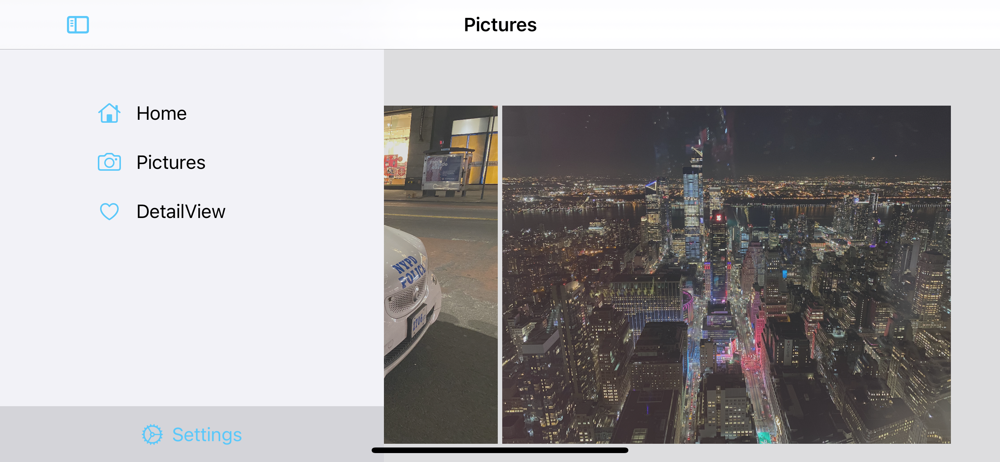
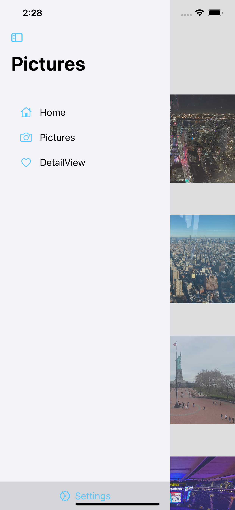

# UniversalSwiftUISidebar

## Supported OS

* iOS 14 beta 1
* iPadOS 14 beta 1
* macOS 11 beta 1

This project is using the new SwiftUI Multiplatform Template from Xcode 12 beta 1

In Xcode 12 Apple introduced a new Sidebar for iPad and macOS. However on iPhone the Sidebar is only supported by iPhone Pro Max Models.

I modified this template in the way that i get on macOS, iOS and iPadOS, independent from the device orientation a sidebar.

## macOS

## iPadOS

## iOS

